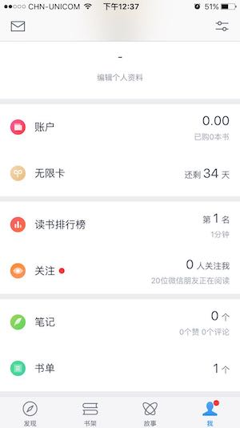
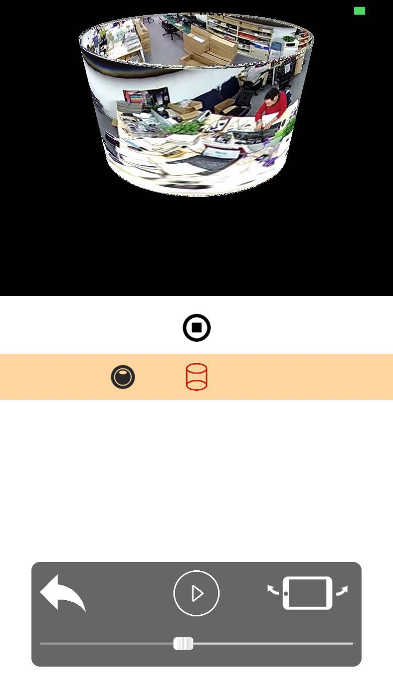
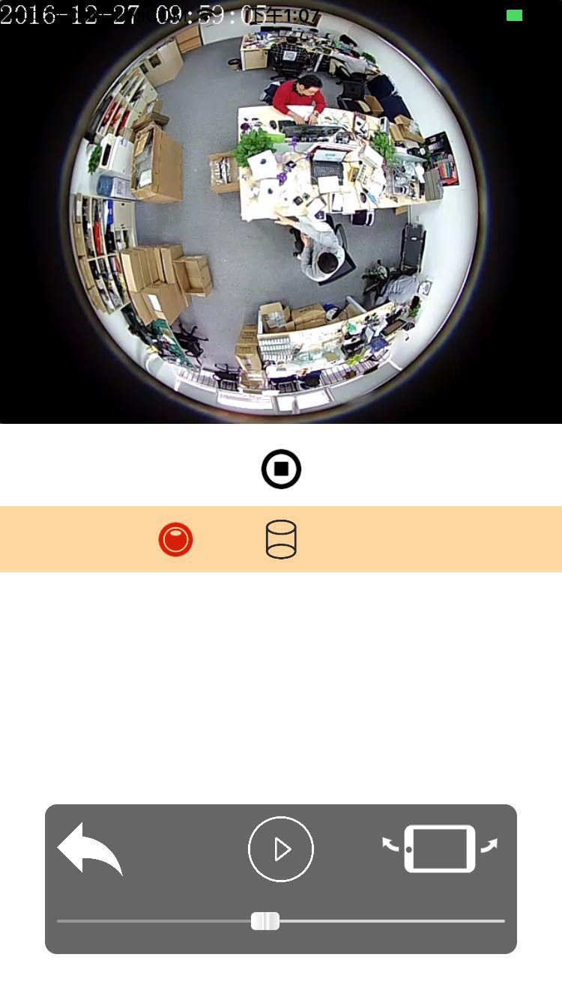
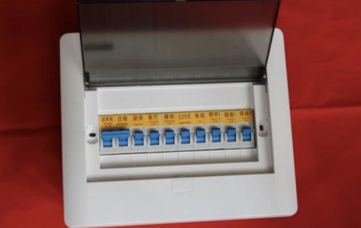
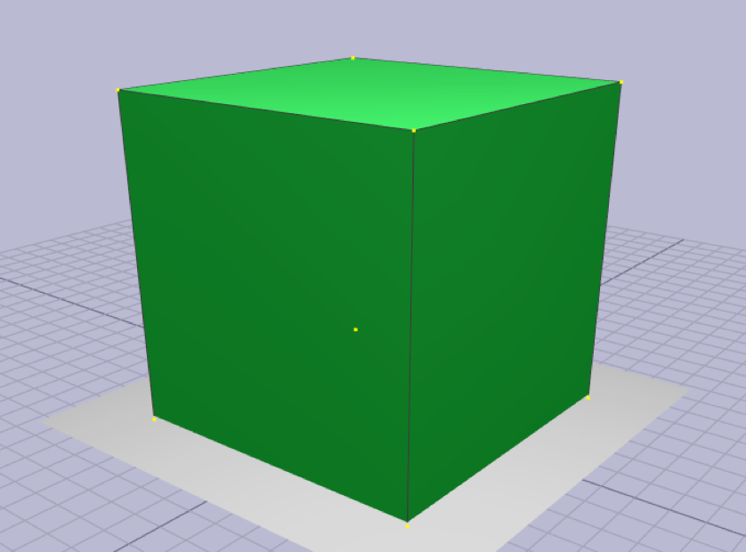
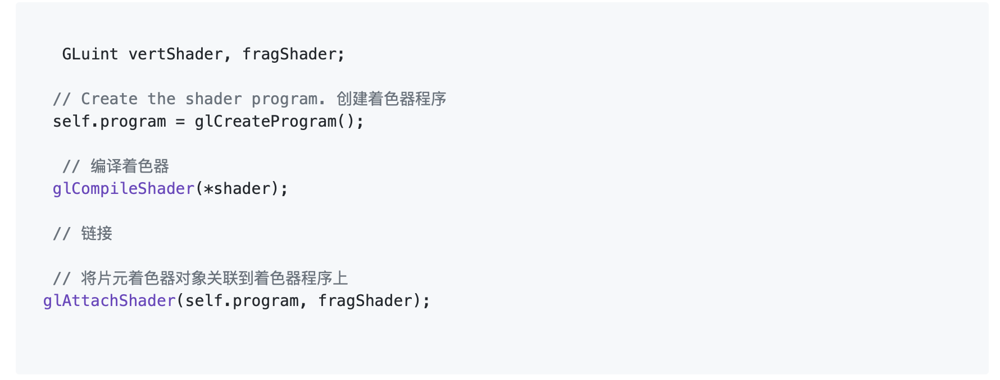

# 01-iOS音视频渲染开发之-OpenGL入门之名词解析


## 目录:

1. [图形API](#api)
2. [OpenGL 上下⽂文(context)](#opengl-context)
3. [OpenGL 状态机](#state-machine)
4. [渲染](#rendering)
5. [顶点数组(VertexArray)和顶点缓冲区(VertexBuffer)](#vertexarray-vertexbuffer)
6. [管线](#pipeline)
7. [固定管线/存储着⾊色器器](#pipeline2)
8. [着色器程序Shader](#shader-program)
9. [顶点着色器VertexShader](#)
10. [⽚元着⾊色器器程序FragmentShader](#)
11. [GLSL(OpenGL Shading Language)](#)
12. [光栅化Rasterization](#)
13. [纹理](#)
14. [混合(Blending)](#)
15. [纹理](#)
16. [变换矩阵(Transformation)](#)
17. [ 投影矩阵Projection](#)
18. [渲染上屏/交换缓冲区(SwapBuffer)](#)
19. [ 2D笛卡尔坐标系](#)
20. [3D笛卡尔坐标系](#)
21. [视口](#)
22. [纹理](#)
23. [纹理](#)
24. [纹理](#)
25. [纹理](#)
26. [纹理](#)
27. [纹理](#)


### api
### 图形API---画画用的

简单的说所谓的`图形api`, 就是用来画画用的.

那么`图形api`,是画画用的(渲染). 画在哪?屏幕上. 画在哪个屏幕?手机或者电脑的屏幕.  画屏幕那个地方? 由开发者决定. 画什么颜色?由开发者决定. 是3D还是2d? 由开发者决定. 

实际上我们使用电脑或者手机我们看到的视频/图片/控件什么的都是用`视频像素数据`画(渲染)出来的.  不管是视频图片或者如下的`TabBar`我们看到的是手机,是手机的屏幕, 是手机屏幕某个区域,然后这个区域有个可以交互的`TabBar`它有`xx宽`有`xx高`上有个头像和一个文字`我`他们有着`xx颜色`, 它是被画(渲染)出来的.是iOS系统渲染出来的. iOS系统怎么渲染出来的? iOS调用了相关接口然后将其渲染出来.

当然像渲染控件类的相关接口我们是没必要接触的. 实际上普通的开发者学习`图形API`是为了做视频,或者游戏或者医疗建筑等的客户端程序.反正就是做客户端的.




所以我们能用`图形api`做的大概就是画个普通播放器(2D, 或者3D)渲染视频, 在视频上加个特效什么的. 好比下面这样


ps: 图中播发器的时间也是画出来的哦


大概有如下这几种
`OpenGL`, `OpenGL ES`, `Vulkan`, `Metal`,`Directx`
听一个抖音的iOS大神说抖音里有些特效好像是`Vulkan`做的.混个面熟啦. 不一一解释.反正他们都是画画来的就行了,简单理解就这样.


### opengl context
### OpenGL 上下⽂文(context)


`在应⽤用程序调⽤用任何OpenGL的指令之前，需要安排⾸首先创建⼀一个OpenGL的 上下⽂文。这个上下⽂文是⼀一个⾮非常庞⼤大的状态机，保存了了OpenGL中的各种状 态，这也是OpenGL指令执⾏行行的基础`

`OpenGL的函数不不管在哪个语⾔言中，都是类似C语⾔言⼀一样的⾯面向过程的函 数，本质上都是对OpenGL上下⽂文这个庞⼤大的状态机中的某个状态或者对象 进⾏行行操作，当然你得⾸首先把这个对象设置为当前对象。因此，通过对 OpenGL指令的封装，是可以将OpenGL的相关调⽤用封装成为⼀一个⾯面向对象的 图形API的`

`由于OpenGL上下⽂文是⼀一个巨⼤大的状态机，切换上下⽂文往往会产⽣生较⼤大的开 销，但是不不同的绘制模块，可能需要使⽤用完全独⽴立的状态管理理。因此，可 以在应⽤用程序中分别创建多个不不同的上下⽂文，在不不同线程中使⽤用不不同的上 下⽂文，上下⽂文之间共享纹理理、缓冲区等资源。这样的⽅方案，会⽐比反复切换 上下⽂文，或者⼤大量量修改渲染状态，更更加合理理⾼高效的.`

上面是比较比较专业的总结.而对于我们初学者来说就`好像`下面这个东西.


我说的是好像哈, 大概意思了, 客厅的吊灯有几种光, 一般我们开启普通照明, 我们也可以开启普通照明的时候再开启其他一种或多种颜色.有的还有闪烁什么的. 是谁在照明? 是吊灯. 是谁让吊灯照明的? 是我们.  我们怎么就让吊灯亮了? 我们拨动开关.

简单的来说上下文就是一个状态机(好比开关), 它记录了我们开启了什么功能.


### state machine
### OpenGL 状态机---总开关

关键词:`开启`,`关闭`, `设置`
我们可以通过状态机开启啥啥功能,关闭啥啥功能,设置为啥啥样式.


状态机是理理论上的⼀一种机器器.这个⾮非常难以理理解.所以我们把这个状态机这么 理理解.状态机描述了了⼀一个对象在其⽣生命周期内所经历的各种状态，状态间的 转变，发⽣生转变的动因，条件及转变中所执⾏行行的活动。或者说，状态机是 ⼀一种⾏行行为，说明对象在其⽣生命周期中响应事件所经历的状态序列列以及对那 些状态事件的响应。因此具有以下特点:

- 有记忆功能，能记住其当前的状态

- 可以接收输⼊入，根据输⼊入的内容和⾃自⼰己的原先状态，修改⾃自⼰己当前状 态，并且可以有对应输出

- 当进⼊入特殊状态(停机状态)的时候，变不不再接收输⼊入，停⽌止⼯工作;


使用场景
```c
// 记录一个颜色
glClearColor(1.0,1.0,1.0,1.0); 
// 开启一个深度测试
glEable(GL_DEPATH_TEST);

// 开启一个颜色混合
glEable(GL_BLEND);

```


### rendering
### 渲染

专业说法:将图形/图像数据转换成3D空间图像操作叫做渲染(Rendering).

怎么理解? 实际上在OpenGL的世界是有一个坐标系的,这是坐标系是一个空间坐标系也就是三维坐标系, 我们做一个简单的矩形播放器,虽然是矩形但是它也是在一个空间坐标系里面的,只是我们看到的只是平面而已, 视频数据画在的是一个空间中的某个平面区域.





### vertexarray vertexbuffer
### 顶点数组(VertexArray)和顶点缓冲区(VertexBuffer)

画图⼀一般是先画好图像的⻣骨架，然后再往⻣骨架⾥里里⾯面填充颜⾊色，这对于 OpenGL也是⼀一样的。顶点数据就是要画的图像的⻣骨架，和现实中不不同的 是，OpenGL中的图像都是由图元组成。在OpenGLES中，有3种类型的图 元:点、线、三⻆角形。那这些顶点数据最终是存储在哪⾥里里的呢?开发者可 以选择设定函数指针，在调⽤用绘制⽅方法的时候，直接由内存传⼊入顶点数 据，也就是说这部分数据之前是存储在内存当中的，被称为顶点数组。⽽而 性能更更⾼高的做法是，提前分配⼀一块显存，将顶点数据预先传⼊入到显存当 中。这部分的显存，就被称为顶点缓冲区

顶点指的是我们在绘制⼀一个图形时,它的顶点位置数据.⽽而这个数据可以直接 存储在数组中或者将其缓存到GPU内存中


### pipeline
### 管线

管线:在OpenGL 下渲染图形,就会有经历⼀一个⼀一个节点.⽽而这样的操作可以理理解管 线.⼤大家可以想象成`流水线`.每个任务类似流⽔水线般执⾏行行.任务之间有先后顺序. 管 线是⼀一个抽象的概念，之所以称之为管线是因为显卡在处理理数据的时候是按照 ⼀一个固定的顺序来的，⽽而且严格按照这个顺序。就像⽔水从⼀一根管⼦子的⼀一端流到 另⼀一端，这个顺序是不不能打破的


### pipeline2
### 固定管线/存储着⾊色器器

在早期的OpenGL 版本,它封装了了很多种着⾊色器器程序块内置的⼀一段包含了了光 照、坐标变换、裁剪等等诸多功能的固定shader程序来完成,来帮助开发者 来完成图形的渲染. ⽽而开发者只需要传⼊入相应的参数,就能快速完成图形的 渲染. 类似于iOS开发会封装很多API,⽽而我们只需要调⽤用,就可以实现功能.不不 需要关注底层实现原理理

但是由于OpenGL 的使⽤用场景⾮非常丰富,固定管线或存储着⾊色器器⽆无法完成每⼀一 个业务.这时将相关部分开放成可编程


### shader program
### 着⾊器程序Shader


好像下面这样
```c


   GLuint vertShader, fragShader;

  // Create the shader program. 创建着色器程序
  self.program = glCreateProgram();

   // 编译着色器
  glCompileShader(*shader);

  // 链接

  // 将片元着色器对象关联到着色器程序上
 glAttachShader(self.program, fragShader);


```


OpenGL在处理理shader时，和其他编译器一样。通过编译、链接等步骤，生成了着⾊色器器程序(glProgram)，着⾊器程序同时包含了顶点着色器和片元着色器的运算逻辑。在OpenGL进行绘制的时候，首先由顶点着⾊器器对传⼊入 的顶点数据进⾏行行运算。再通过图元装配，将顶点转换为图元。然后进⾏行行光 栅化，将图元这种⽮矢量量图形，转换为栅格化数据。最后，将栅格化数据传 ⼊入⽚片段着⾊色器器中进⾏行行运算。⽚片段着⾊色器器会对栅格化数据中的每⼀一个像素进 ⾏行行运算，并决定像素的颜⾊色


就全⾯面的将固定渲染管线架构变为了了可编程渲染管线。因此，OpenGL在实 际调⽤用绘制函数之前，还需要指定⼀一个由shader编译成的着⾊色器器程序。常 ⻅见的着⾊色器器主要有顶点着⾊色器器(VertexShader)，⽚片段着⾊色器器 (FragmentShader)/像素着⾊色器器(PixelShader)，⼏几何着⾊色器器 (GeometryShader)，曲⾯面细分着⾊色器器(TessellationShader)。⽚片段着⾊色 器器和像素着⾊色器器只是在OpenGL和DX中的不不同叫法⽽而已。可惜的是，直到 OpenGLES 3.0，依然只⽀支持了了顶点着⾊色器器和⽚片段着⾊色器器这两个最基础的着⾊色 器器。