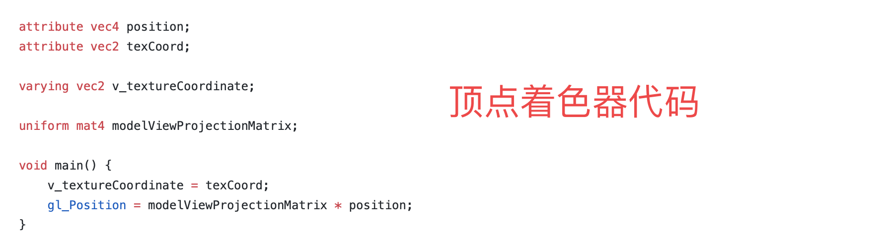
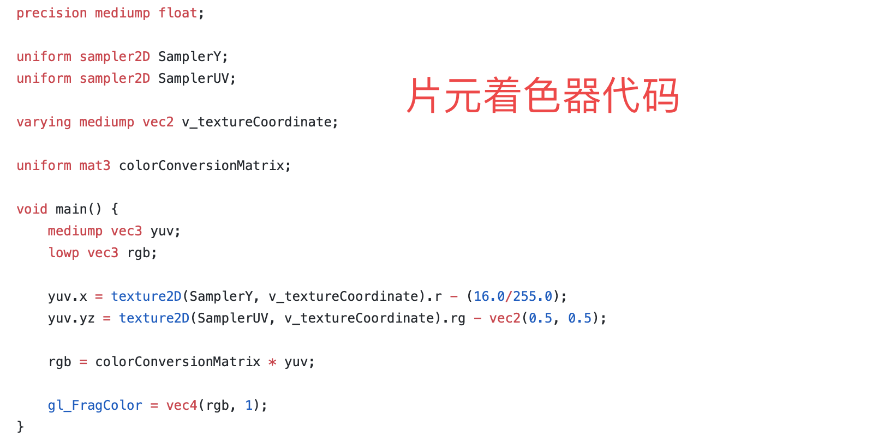
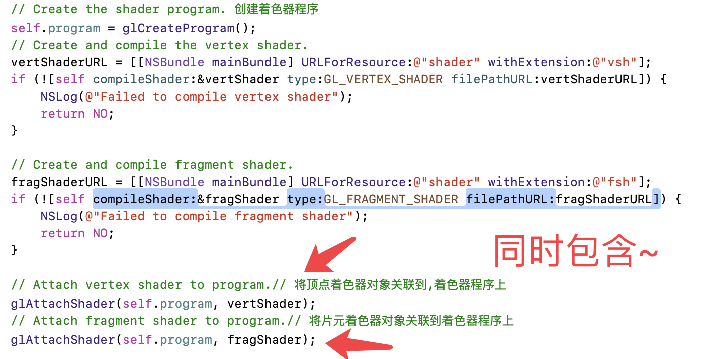

# 着色器程序 Program

OpenGL 目前(2019-08-02 10:20:06)为止开放了两个着色器,   顶点着色器和片元着色器. 我们可以编写两个着色器代码.好像下面这样.

## 顶点着色器

## 片元着色器

就像我们编写其它代码一样, 我们要这些代码`“跑起来”`必须要将其`编译``链接`成程序. 那,这就是着色器程序了.

# 着色器程序同时包含了顶点着色器和片元着色器的运算逻辑

就好像下面这样

# 每一个顶点
### 每一个顶点都要跑一遍顶点着色器

# 也就是说每个顶点都要执行一下下面这个代码
## 顶点着色器

